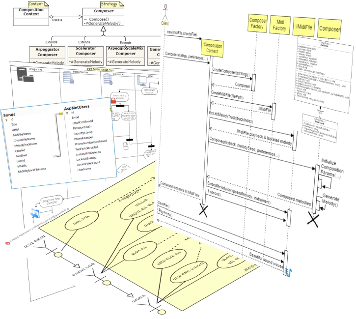

# Soloist :guitar:  
**Application Home Page :** __*http://soloist.gear.host*__  

## Description  :musical_score:  
Soloist is a web application which generates solo-melodies improvisations over a given playback.  

### Design Documentation  :memo:
* [User Manual.](Design/Documents/pdf/User-Manual.pdf) :man_teacher:
* <a href="https://github.com/cwelt/Soloist/blob/master/Design/Documents/pdf/Genetic-Algorithms-For-Melody-Generation-Seminar-Paper.pdf" target="_blank">User Manual.</a>
* [Object-Orineted Analysis Document (OOA)](Design/Documents/pdf/OOA-Object-Oriented-Analysis.pdf)  :clipboard:
* [Object-Orineted Design   Document (OOD)](Design/Documents/pdf/OOA-Object-Oriented-Design.pdf)    :triangular_ruler:
* [Genetic Algorithms Composition Seminar Paper.](Design/Documents/pdf/Genetic-Algorithms-For-Melody-Generation-Seminar-Paper.pdf) :books: 



<hr/>

## Further Details :musical_keyboard: 
Given a midi-file & a chord-progression as input,   
along with other user preferences & constraints,  
Soloist analyzes the chord-progression,    
generates a new melody over it using a [genetic algorithm](https://en.wikipedia.org/wiki/Genetic_algorithm),  
and finally replaces the original melody track in the MIDI file  
with the new generated melody.
<hr/>

## Try It Yourself! :musical_note:
[_**Click Here**_](http://soloist.gear.host/Composition/Compose) to try it out your self: 
Just select a song, mark your preferences,  
hit the submit button, and VWallaaaaa -  
your new generated melody would be automatically downloaded as MIDI file. 


## Initial Prototype Sample for Desktop Application :notes: 


## Code Snippet :man_technologist:
This appliation implements a genetic algorithm to carry out the composition process. 
 ```csharp
 
        private protected override IEnumerable<IList<IBar>> GenerateMelody()
        {
            // get first generatiion 
            PopulateFirstGeneration();

            int i = 0;
            bool terminateCondition = false;

            while (!terminateCondition)
            {
                // update generation counter 
                _currentGeneration++;

                // mix and combine pieces of different individuals 
                Crossover();

                // modify parts of individuals 
                Mutate();

                // rate each individual 
                EvaluateFitness();

                // natural selection 
                SelectNextGeneration();

                // Check if termination conditions are met 
                if (++i == MaxNumberOfIterations || (_candidates.Select(c => c.FitnessGrade).Max() >= CuttingEvaluationGrade))
                        terminateCondition = true;                   
            }
            //...
                        // return the result 
            IEnumerable<IList<IBar>> composedMelodies = _candidates
                .OrderByDescending(c => c.FitnessGrade)
                .Select(c => c.Bars);
            return composedMelodies;
       }
```


