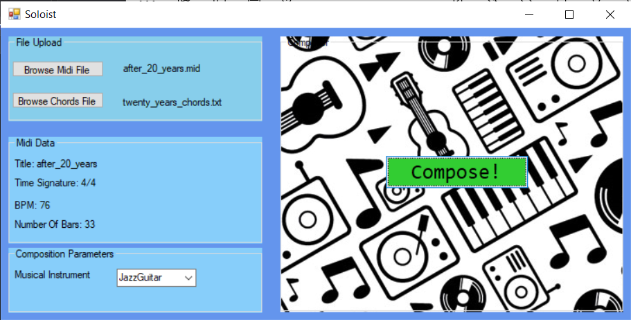

# Soloist :guitar:
 :musical_note: :notes: :musical_score:  :musical_keyboard: 

## Description 
Soloist is a web application which generates solo-melodies improvisations over a given playback.  
**Home Page:** __*http://soloist.gear.host*__

## Try It Yourself!
[_**Click Here**_](http://soloist.gear.host/Composition/Compose) to try it out your self:  
just select your preferences, hit the submit button, and VWallaaaaa -  
your new generated melody would be automatically downloaded as MIDI file. 

## Further Details 
Given a midi-file & a chord-progression as input,   
along with other user preferences & constraints,  
Soloist analyzes the chord-progression,    
generates a new melody over it using a [genetic algorithm](https://en.wikipedia.org/wiki/Genetic_algorithm),  
and finally replaces the original melody track in the MIDI file with the new generated melody,   
and downloads it straight to your device. 

This appliation implements a genetic algorithm to carry out the composition process. 

## Initial Prototype Sample for Desktop Application

